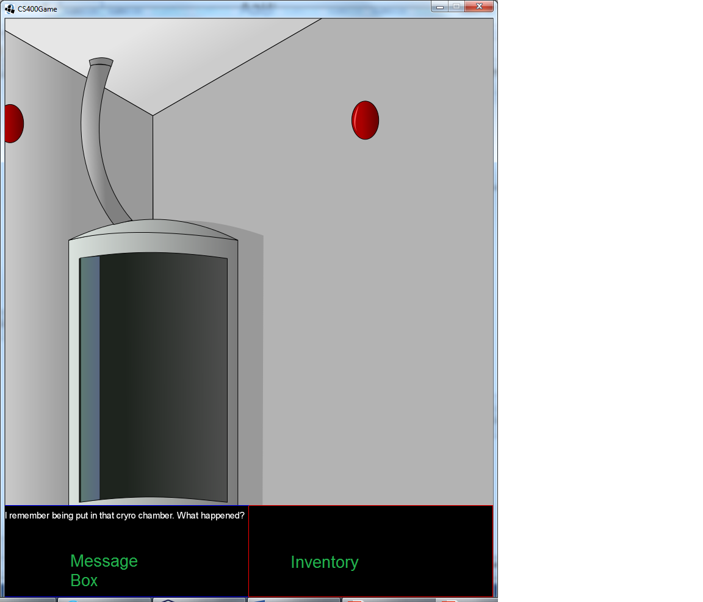
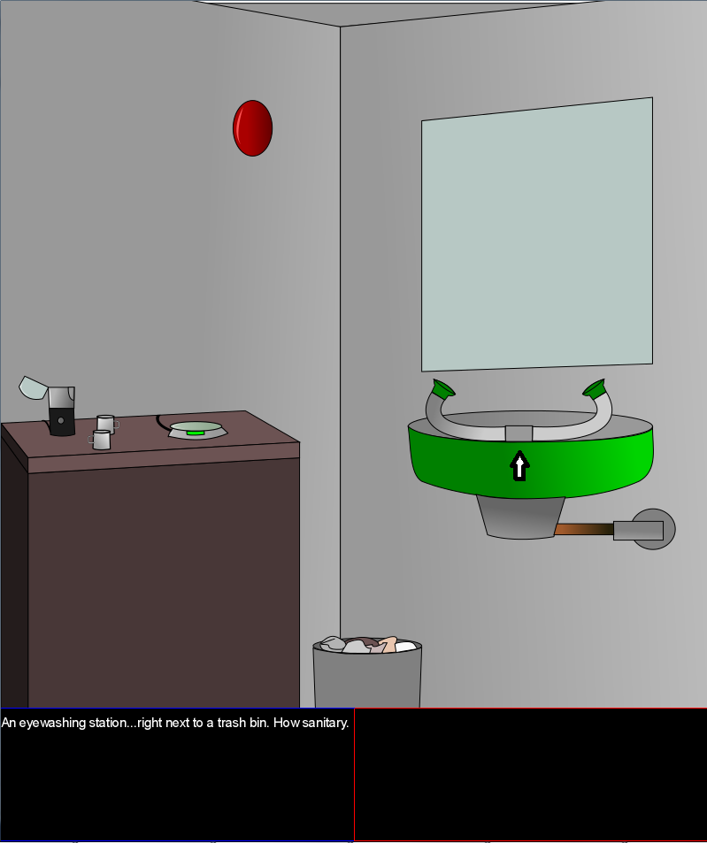
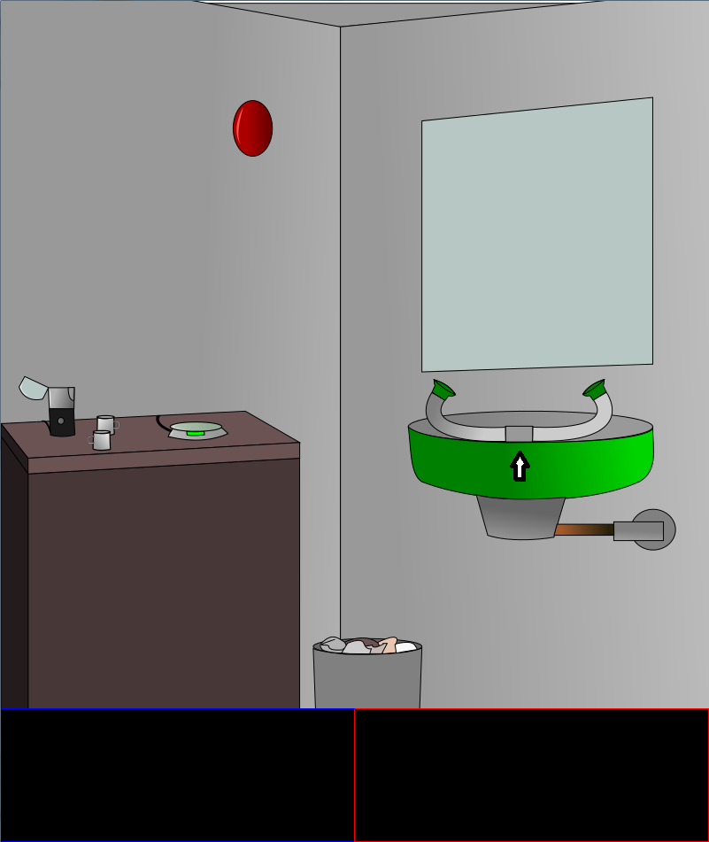
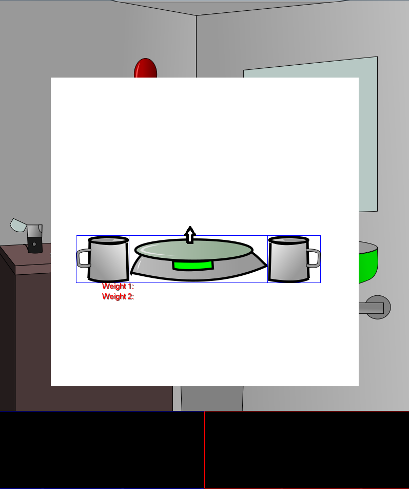
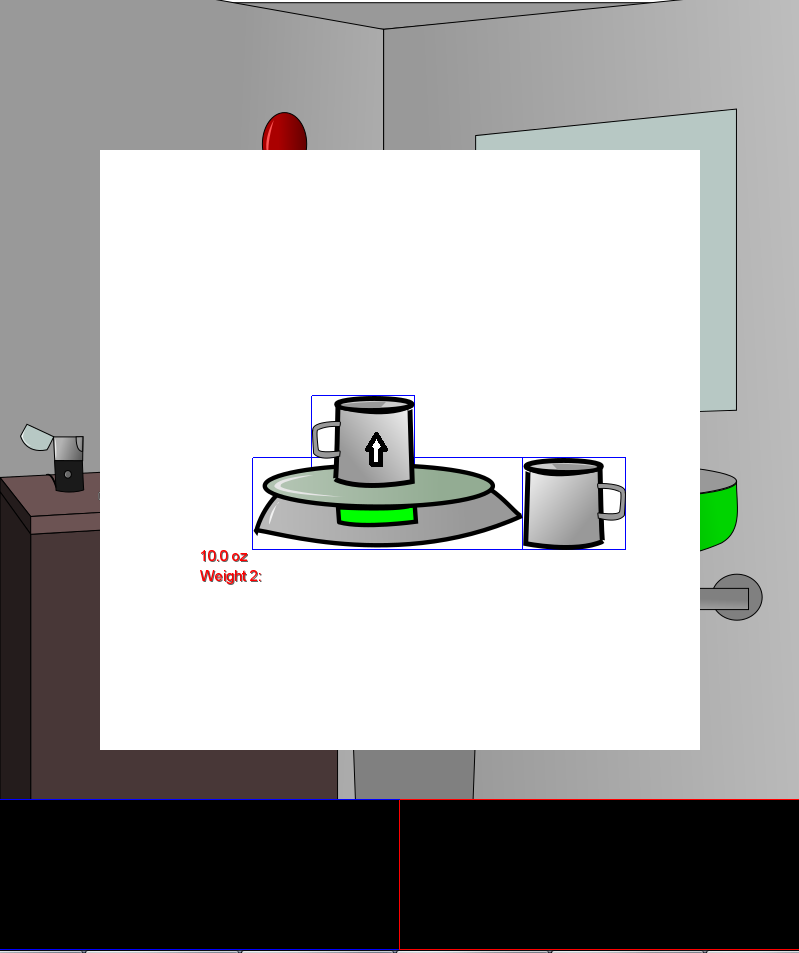
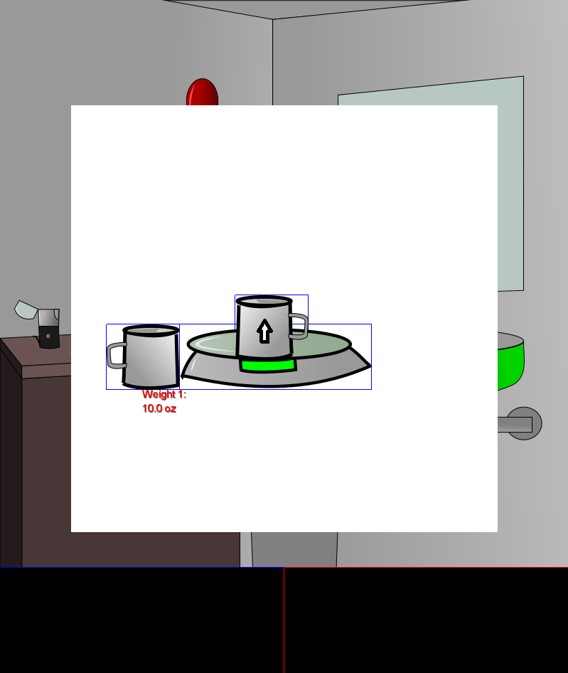

# Last Asylum User Manual

By Aaron Andries, A'Jee Sieka, and Robert Settles

April 2017

## Purpose

This manual provides descriptions of the interface of the game, the
usage of each interactive element, the control scheme, and future plans
and features for the game.

## Background

We wanted to make a game, and to meet the criteria of this assignment,
we decided to develop software to entertain and educate. Having played
educational games in the past that failed to hold the users attention,
we hoped that by building a more entertaining experience, we could
maintain some of the educational effectiveness that is often lost in
other tools that are unable to hold student attention.

## About the Developers

We are a team of three students at Bellarmine University enrolled in CS
400: Software Engineering during the 2017 school year.

## The Game Mechanics

The game's demo is centered around point-and-click input where the user
clicks on objects and as a result some action occurs. When Users click
objects, they will receive a message in the message box (see image
below), collect an object that will be placed in the inventory (see
image below), and interact with puzzles (detailed later). Some keys on
the keyboard will be used to control in-game navigation, to use certain
items, and to interact with puzzles along with the mouse.

## Controls

Note that these instructions are specific to the demo and are subject to
change if this project were developed further.

Left Mouse Button -- Interact

'A' key or '←' key -- Turn left

'D' key or '→' key -- Turn right

'R' key -- Read note; notes contain helpful information to help the
player advance

\'I\' key -- List the names of each item in the inventory

'1' key -- Select left beaker during chemistry puzzle (the selected
beaker is the "active" beaker and is the only beaker that can be moved)

'2' key -- Select right beaker during chemistry puzzle

## How to Play

**Clicking Objects** - Click on an object using the left mouse button. A
message will then be displayed in the message box providing the player
with more information. In the Images below, the eye-washing sink is
clicked and a message is show. Read these messages to get an idea of
where to go next, or use them rationalize a problem.

**Collecting Objects** -- When certain objects in the main play screen
are clicked, an item will be added to the player\'s inventory to be used
later.

**Turning** -- To turn left (turn to face next wall), press the 'A' key
or '←' key. To turn right, press the D' key or '→' key. In this case,
the player can decide which keys are preferable for turning. In the
demo, there are four walls.

Inventory

As mentioned earlier, items can be stored in the inventory. The
inventory can hold eight items at the most, and an item can be removed
from the inventory to be used. To use an item, it must be selected by
clicking on it in the inventory, and upon doing so, a red rectangle will
outline its image. When an item is selected, it can be combined with
another item or applied to some object in the room (i.e. using a key on
a door). Once an item has fulfilled its purpose (used on some object in
the room), it will be removed from the inventory.

## Puzzles

A puzzle may be used as a sort of test the user must pass to progress to
the next level. This is the main source of the game\'s educational
content. The demo only contains one level and one puzzle (a chemistry
and mathematics puzzle), but there might be many different kinds of
puzzles if the game\'s development continued further.

The puzzle featured in the demo is a chemistry puzzle that consists of
measuring two substances with containers and a scale to find the proper
weight ratio to mix the substances. The texture of the containers and
scale may change from level to level, but the core mechanics of the
puzzle will remain the same. This means that the containers used in the
demo are mugs (as seen below), but in another level they may be plastic
bottles, cups, some other improvised containers, or proper beakers.

When the left mouse button is held down and the cursor is inside the
puzzle\'s window (the white box), the active beaker (the left beaker by
default) is moved to the cursor\'s position and is dragged anywhere
inside the puzzle\'s window. If the cursor is moved outside the
puzzle\'s window or if the left mouse button is let go, the beaker will
return to its original position. To weigh a beaker, drag it onto the
scale.

To change the active beaker, use the \'1\' key or the \'2\' key. \'1\'
selects the left beaker and \'2\' selects the right beaker. The right
beaker can also be weighed on the scale.

The puzzle is completed once there is a proper ratio of the two
substances. In the demo, the user must have a ratio of 27:80 for
aluminum powder and rust, respectively. This translates to about 1
teaspoon of aluminum powder to 40 teaspoons of rust. Once this ratio is
achieved, the text in the puzzle will turn green and the new compound
will be placed into the user's inventory.

## Future Expansion

Given the limited development time, some features didn't make it into
the game. These left out features could be used to expand and improve
gameplay, as well as transform this game into a more powerful
educational tool. If development were continued, the following changes
and additions would be made:

-   A tool to collect user statistics and generate progress reports;
    these reports could be used by school administrators to measure a
    student comprehension

-   More levels and puzzles

-   Platforming gameplay sections

-   More stylized graphics
